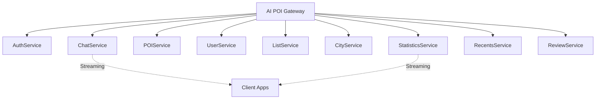

# AI POI gRPC Protocol Buffers

This directory contains the Protocol Buffer (protobuf) definitions for the AI POI microservices architecture. These proto files define the gRPC services and message types for all API endpoints.

## 📁 Proto Files Overview

### Core Services

| Proto File | Service | Description | Streaming |
|------------|---------|-------------|-----------|
| `auth.proto` | `AuthService` | Authentication and authorization | ❌ |
| `chat.proto` | `ChatService` | AI-powered chat with streaming | ✅ |
| `poi.proto` | `POIService` | Points of interest discovery | ❌ |
| `user.proto` | `UserService` | User profiles and preferences | ❌ |
| `list.proto` | `ListService` | Lists and itinerary management | ❌ |
| `city.proto` | `CityService` | City information and statistics | ❌ |
| `statistics.proto` | `StatisticsService` | Analytics and metrics | ✅ |
| `recents.proto` | `RecentsService` | Recent user interactions | ❌ |
| `review.proto` | `ReviewService` | Reviews and ratings | ❌ |

### Support Files

| Proto File | Description |
|------------|-------------|
| `common.proto` | Shared types and utilities |
| `ai_poi_service.proto` | Main API gateway service |

## 🔄 Streaming Services

The following services support gRPC streaming for real-time functionality:

### ChatService (chat.proto)
- **StartChatStream**: Start new chat with AI streaming responses
- **ContinueChatStream**: Continue existing chat session
- **FreeChatStream**: Public chat without authentication

### StatisticsService (statistics.proto)
- **StreamMainPageStatistics**: Real-time statistics updates

## 🔐 Authentication

Most services require authentication except:
- `ChatService.FreeChatStream`
- `StatisticsService.GetMainPageStatistics` 
- `CityService.GetCities`
- Health check endpoints

Authentication is handled via JWT tokens in gRPC metadata.

## 📊 Key Features

### Advanced Search Capabilities
- **Semantic Search**: AI-powered POI discovery using embeddings
- **Hybrid Search**: Combines spatial and semantic search
- **Geospatial Queries**: Location-based filtering and sorting

### AI-Powered Features
- **Streaming Chat**: Real-time conversation with AI assistant
- **Personalized Recommendations**: Based on user preferences and history
- **Smart Itinerary Planning**: AI-generated travel plans

### User Management
- **Multi-Profile Support**: Different search profiles per user
- **Preferences & Interests**: Detailed user preference tracking
- **Social Features**: Reviews, ratings, and social interactions

### Content Management
- **Lists & Itineraries**: User-created collections
- **Favorites**: Personal POI bookmarking
- **Content Types**: POIs, restaurants, hotels, attractions

## 🏗️ Service Architecture



## 🔧 Code Generation

To generate Go code from these proto files:

```bash
# Install required tools
go install google.golang.org/protobuf/cmd/protoc-gen-go@latest
go install google.golang.org/grpc/cmd/protoc-gen-go-grpc@latest

# Generate code
protoc --go_out=. --go_opt=paths=source_relative \
       --go-grpc_out=. --go-grpc_opt=paths=source_relative \
       proto/*.proto
```

## 📝 Message Conventions

### Request/Response Patterns
- All requests include user authentication context
- Responses use standardized `Response` wrapper from `common.proto`
- Pagination uses `PaginationRequest`/`PaginationResponse`

### Field Naming
- Use `snake_case` for field names
- Include `_at` suffix for timestamps (e.g., `created_at`)
- Use `_id` suffix for identifiers (e.g., `user_id`)

### Error Handling
- Standardized error codes and messages
- Field-level validation errors
- Trace IDs for debugging

## 🌍 Internationalization

- `MultilingualText` type for multi-language content
- Language codes follow ISO 639-1 standard
- Country codes follow ISO 3166-1 alpha-2

## 📈 Analytics & Metrics

### Statistics Collection
- Real-time metrics streaming
- User activity tracking
- Performance monitoring
- Geographic distribution analysis

### User Analytics
- Search patterns and preferences
- Interaction history and trends
- Personalization insights

## 🔍 Search & Discovery

### POI Discovery
- Category-based filtering
- Price range and rating filters
- Geospatial proximity search
- Opening hours filtering

### Semantic Capabilities
- Natural language query processing
- AI-powered recommendations
- Context-aware suggestions
- Intent recognition

## 📱 Client Integration

These proto files support multiple client platforms:
- **Web**: JavaScript/TypeScript clients
- **Mobile**: Swift (iOS) and Kotlin/Java (Android)
- **Server**: Go microservices communication

## 🚀 Migration from REST

This protobuf definition is designed to replace the existing REST API while maintaining compatibility:

### Streaming Endpoints (New)
- Chat conversations with real-time AI responses
- Live statistics updates
- Real-time notifications

### Standard Endpoints (REST → gRPC)
- All CRUD operations for users, POIs, lists, etc.
- Search and discovery endpoints
- Authentication and authorization

## 📋 TODO

- [ ] Add proto validation rules
- [ ] Implement circuit breaker patterns
- [ ] Add request tracing metadata
- [ ] Define custom error codes
- [ ] Add API versioning strategy
- [ ] Implement field masking for responses
- [ ] Add caching directives in metadata

## 🔗 Related Documentation

- [API Documentation](../docs/swagger.yaml)
- [Database Schema](../app/db/migrations/)
- [Service Architecture](../docs/loci-micro.mermaid)
- [Integration Guide](../docs/INTEGRATION.md)